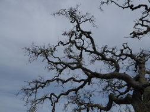
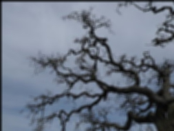

# convolution

A program that reads in a JPEG file and applies a blurring effect to it. 
This blurring effect is achieved by convoluting the image with a gaussian filter. 
There is a sequential convolution and a multi threaded convolution using pthreads. 
The blurred image is then written to the output/ directory. 

## Before and after



## Running
```
git clone https://github.com/thsmale/convolution.git
cd convolution

chmod u+x run.sh
./run
```

## Usage
```c
// Read a single file and blur
blur("/home/tom/images/jpeg_images/image.jpeg")
// Recursively read all the jpeg files in a directory and write the results to convolution/output
read_dir("/home/tom/images/jpeg_images/")
```

## Dependencies
[jpeglib](https://libjpeg.sourceforge.net) for reading and writing jpeg files
GNU standard C library
